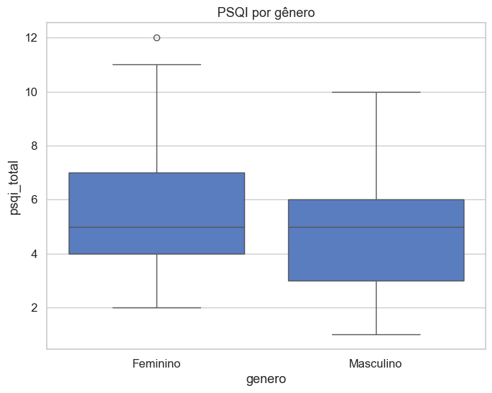

### Hipóteses de Pesquisa

**H1**: **Maior tempo de tela à noite** (uso prolongado de redes sociais antes de dormir) está associado a **pior qualidade do sono**.

* Variáveis envolvidas:

  * `redes_horas` (tempo de redes sociais por dia)
  * `redes_antes_dormir` (uso até 2h antes de dormir)
  * `sono_qualidade` (percepção de sono leve/agitado)
  * `pontuacao` (caso seja uma escala de qualidade)

**H2**: **Uso de redes sociais após as 22h** eleva a probabilidade de apresentar **pior escore de sono**.

* Variáveis envolvidas:

  * `redes_antes_dormir` (proxy para uso após 22h)
  * `sono_horas` (duração média do sono)
  * `sono_tempo_adormecer` (latência do sono)
  * `pontuacao`

**H3**: **Fatores de confusão** (idade, trabalho, exercício físico, consumo de café/energéticos) modulam a relação entre tempo de tela e qualidade do sono.

* Variáveis de controle:

  * `idade`
  * `trabalho_modalidade` e `trabalho_horas`
  * `exercicio_freq`
  * `cafe_apos_18h`

### Estrutura para análise estatística:

* **H1** → Correlação (Pearson/Spearman) entre `redes_horas`/`redes_antes_dormir` e `sono_qualidade`/`pontuacao`.
* **H2** → Teste de diferença de médias (t-test ou Mann-Whitney) entre grupos (usa vs. não usa após 22h).
* **H3** → Regressão logística ou linear múltipla, incluindo fatores de confusão como variáveis independentes.

# Análises Gráficas do PSQI

## Distribuição do escore PSQI total
  
Mostra a distribuição geral dos escores PSQI entre os participantes.

---

## Classificação da qualidade do sono
  
Apresenta a categorização do sono em **Bom**, **Ruim** e **Distúrbio**, com base nos escores PSQI.

---

## PSQI por gênero
  
Compara os escores do PSQI entre diferentes gêneros.

---

## PSQI por faixa etária
  
Mostra a variação dos escores PSQI ao longo das idades dos participantes.

---

## Média de PSQI por frequência de exercício
  
Apresenta a relação entre prática de exercícios físicos e a qualidade do sono.

---

## Média de PSQI por uso de redes antes de dormir
  
Mostra o impacto do uso de redes sociais antes de dormir nos escores PSQI.

---

## PSQI por tempo em redes sociais (boxplot)
  
Compara o PSQI em função do tempo médio gasto em redes sociais por dia.

---

## PSQI vs. consumo de café após 18h
  
Analisa a relação entre consumo de café no período da noite e qualidade do sono.

---

## Correlação entre componentes do PSQI
  
Exibe a matriz de correlação entre os diferentes componentes que compõem o PSQI.

---

## Perfil médio dos componentes do PSQI
  
Mostra um gráfico de radar com o perfil médio de cada componente do PSQI.

---

## PSQI médio por idade e horas de trabalho
  
Apresenta a média do PSQI considerando simultaneamente idade e carga horária de trabalho.